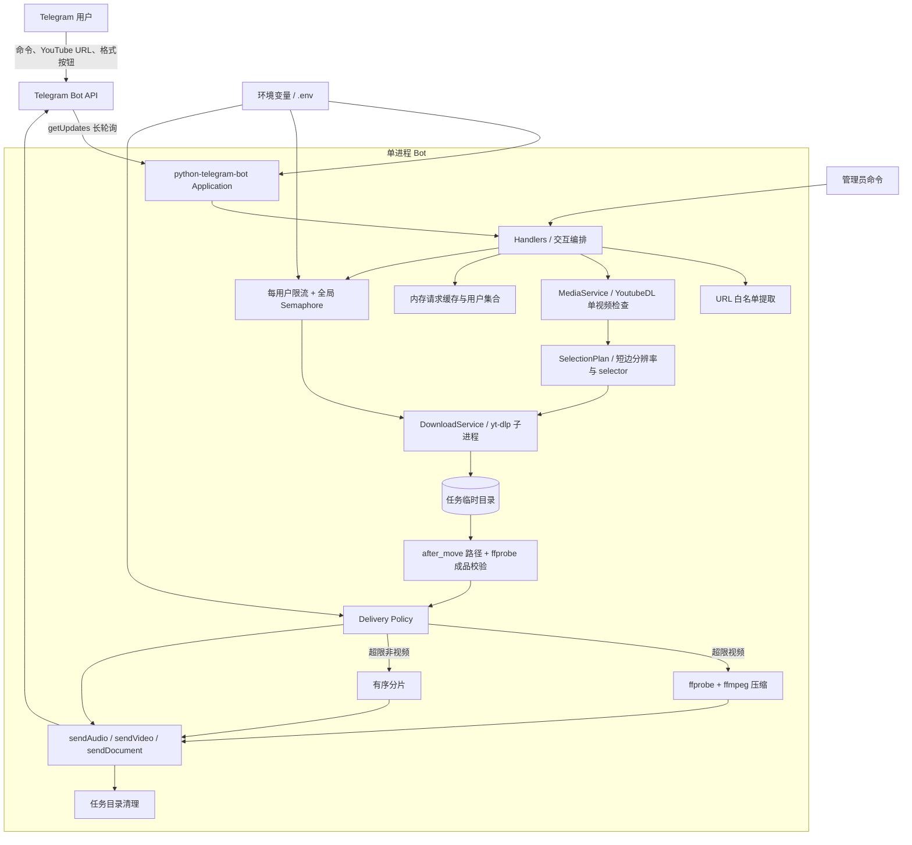
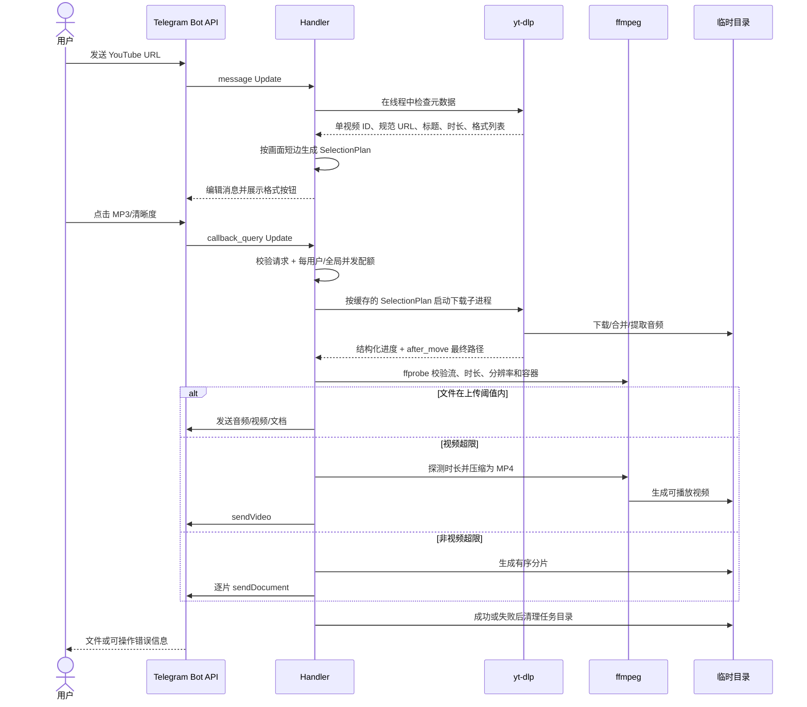
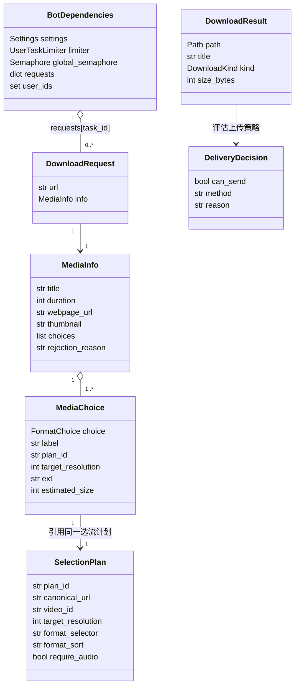
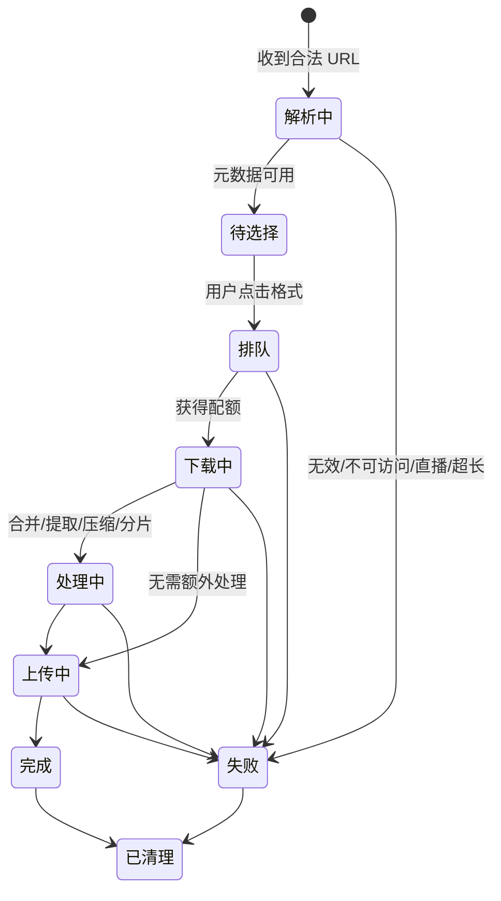
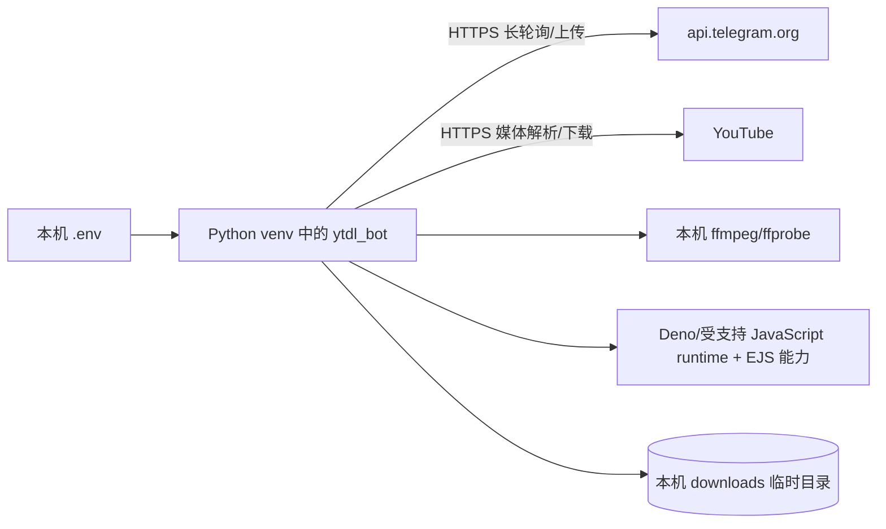
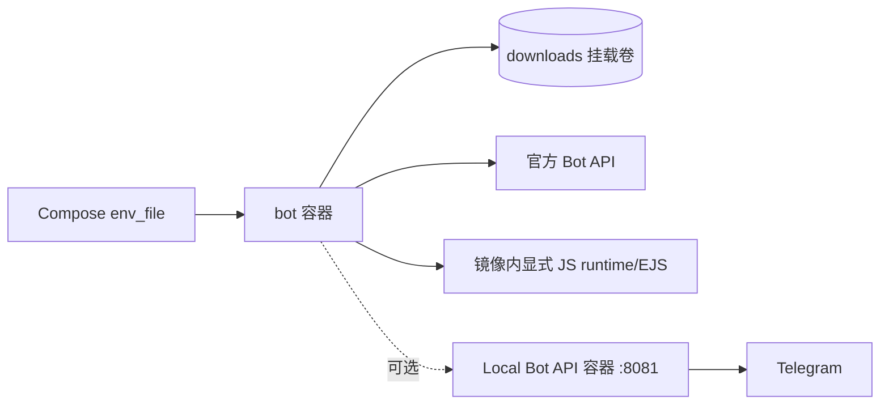
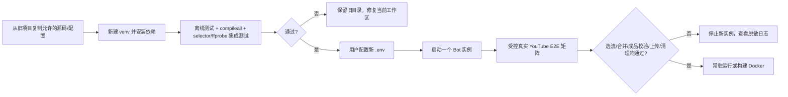

# 系统架构文档

## 文档信息
- **功能名称**：youtube-telegram-bot
- **版本**：1.1
- **创建日期**：2026-08-23
- **作者**：Architect Agent
- **架构基线**：从 `/Users/wsejoy/Documents/ytdl_bot` 恢复并迁移到当前工作区；旧项目保持不变

## 摘要

> 下游 Agent 请优先阅读本节，需要细节时再查阅完整文档。

- **架构模式**：单进程、事件驱动的异步 Python 单体 Bot；Telegram 长轮询；无 Web UI、无数据库、单实例运行。
- **技术栈**：Python 3.12+（本机已验证 3.14.3）/ python-telegram-bot 22.7 / yt-dlp 2026.03.17 / ffmpeg 8.0.1 / pydantic-settings 2.14.1 / pytest 9.0.3；本机虚拟环境优先，Docker Compose 可选。
- **核心设计决策**：① 迁移旧源码和测试，但把真实 YouTube 成品正确性作为门禁，不能用 32 项离线测试替代；② 保留 `YoutubeDL` 元数据解析 + 参数数组子进程下载 + ffmpeg 转码的分层边界，同时统一“按钮枚举”和“实际选流”策略；③ 用 yt-dlp 的 `after_move:filepath` 明确取得成品并用 ffprobe 验证，不再按修改时间猜文件；④ 运行态和限流只放内存，媒体只放任务临时目录，任务结束立即清理。
- **主要风险**：旧 selector 会优先命中低清晰度 progressive MP4，使 720p/1080p 按钮实际下载 360p；竖屏 Shorts 按 `height` 精确枚举会漏选或错标；`--merge-output-format mp4` 不保证所有单流/回退结果都是 Telegram 可播放 MP4；YouTube 的 JavaScript 解题运行时/组件缺失会造成格式不完整；成品路径启发式可能选错；另有 Update 串行、上传上限、磁盘/CPU、缓存 TTL 和内容授权风险。
- **项目结构**：采用 `src/ytdl_bot/` 包布局，模块按配置、Handler、解析、下载、转码、交付、限流和清理拆分；`tests/` 保留原测试，`.boss/` 仅存项目产物。
- **迁移原则**：不要复制旧 `.venv`、`.env`、下载缓存、构建元数据或测试缓存；在新目录重建虚拟环境并由用户重新配置 Bot Token。

---

## 0. 技术调研

### 0.1 调研输入与可信度

本架构以旧项目真实源码、`pyproject.toml`、Docker 配置、README、设计规格和实现计划为第一手基线，并在本机只读核验运行时版本。外部事实仅采用官方资料：

- [python-telegram-bot 22.7 文档](https://docs.python-telegram-bot.org/en/v22.7/)：`Application`、Handler、长轮询、HTTPX 请求配置和并发 Update 模型。
- [yt-dlp 官方 README](https://github.com/yt-dlp/yt-dlp/blob/master/README.md)：Python 嵌入、格式选择、结构化进度模板、输出模板和 ffmpeg 依赖。
- [Telegram Bot API](https://core.telegram.org/bots/api)：消息、回调、音频、视频和文档发送接口。
- [Telegram Bot Features - Local Bot API](https://core.telegram.org/bots/features#local-bot-api)：官方 API 上传 50 MB、Local Bot API 上传 2000 MB；限制可能变化，必须以部署时官方说明和实测为准。

旧项目现状为 32 项测试通过，因而“迁移已有实现并补齐已知架构缺口”比重写更低风险。

### 0.2 关键方案对比

| 领域 | 方案 | 优点 | 代价/风险 | 结论 |
|------|------|------|-----------|------|
| 代码策略 | 迁移旧项目 | 已有模块边界、文档和 32 项测试；恢复最快 | 需清点旧实现缺口 | **采用** |
| 代码策略 | 从零重写 | 可重新设计所有接口 | 重复工作，容易产生行为回归 | 不采用 |
| Bot 框架 | python-telegram-bot 22.7 | 与旧代码和测试完全一致；原生 asyncio、Handler 和 `run_polling` | 需显式设计长任务并发 | **采用** |
| Bot 框架 | aiogram / 直接 HTTP API | 可行，控制粒度高 | 无法复用旧代码，迁移成本高 | 不采用 |
| 接收 Update | 长轮询 | 本机无需公网端口、TLS 或域名；部署简单 | 单实例只能有一个有效轮询消费者 | **MVP 采用** |
| 接收 Update | Webhook | 更适合已有 HTTPS 服务和平台化部署 | 引入 Web 服务、证书和入口运维 | 当前不采用 |
| 持久化 | 进程内状态 + 临时文件 | 零数据库、符合个人 Bot 与单实例范围 | 重启丢失待选请求和用户集合 | **采用** |
| 持久化 | SQLite / PostgreSQL / Redis | 可恢复任务、做多实例和可靠队列 | 超出恢复项目范围，增加运维 | 当前不采用 |
| 下载集成 | `YoutubeDL` 检查 + yt-dlp 子进程下载 | 检查易归一化；下载故障隔离；可解析结构化进度 | 两种调用方式需要一致版本 | **保留旧设计** |
| 下载集成 | 全部 Python API | 少一次进程创建 | 阻塞/钩子异常与 Bot 进程耦合更紧 | 不作为迁移目标 |
| 上传策略 | 官方 Bot API + 压缩/分片 | 无额外服务，本机即可运行 | 超限视频有质量损失，分片文档需手工合并 | **默认采用** |
| 上传策略 | Local Bot API | 单文件上限更高 | 需 API ID/Hash、额外容器、磁盘与网络；切换前有官方操作要求 | 可选增强 |
| 运行方式 | 本机 venv | 最短路径，便于使用本机 ffmpeg | 环境依赖需自行维护 | **先采用** |
| 运行方式 | Docker Compose | 环境可复现、可配置重启策略 | 镜像构建与挂载更复杂 | 可选 |

### 0.3 调研结论

1. 保持无前端、无数据库、无 REST API 的异步单体，不引入微服务。
2. 迁移旧包、测试、README、`.env.example`、Dockerfile 和 Compose 文件；排除任何本机状态和秘密。
3. 本地验收使用长轮询和官方 Bot API；只有在确实需要发送大于 50 MB 的单文件时才启用 Local Bot API。
4. 迁移后应将 Telegram Update 处理并发设为有界值，使长下载不会阻塞所有后续消息；下载资源仍由“每用户限制 + 全局 Semaphore”控制，不能用无限并发代替。
5. `yt-dlp` 与 YouTube 的兼容性是持续维护项；依赖升级必须先跑离线测试，再做一个授权公开链接的手工冒烟测试。

### 0.4 旧代码真实下载链路根因分析

以下结论来自旧项目 `media.py`、`downloader.py` 和调用链的逐行核查。它们解释了“单元测试通过，但真实链接失败或成品不完整”的差异。

| 环节 | 旧实现 | 潜在根因 | 结论/最小修复方向 |
|------|--------|----------|-------------------|
| 格式按钮枚举 | `_best_formats_by_height` 只接收 `height` **恰好**为 360/480/720/1080 的格式 | 竖屏 Shorts 的 1080 档常表现为宽 1080、高 1920；按高度会漏掉或错误降档。非标准尺寸也会被丢弃 | 用短边分辨率 `min(width, height)` 或 yt-dlp 的 `res` 排序语义归档；测试横屏与竖屏 |
| 格式代表项 | `_format_score` 只按 MP4 扩展名和文件大小选一个格式 | 未区分 progressive、video-only、codec、协议和音频存在性；“最大文件”不等于最可播放或最合适 | 形成统一的 `SelectionPlan`，记录目标分辨率、候选 selector、是否需合并/转码 |
| 检查与下载一致性 | `MediaChoice.format_id` 被保存但下载时完全未使用，下载器只拿枚举重新选流 | UI 展示的格式与真正下载的格式没有契约，真实站点格式变化时会漂移 | 检查阶段产出可执行选流计划；回调只引用计划 ID，不再独立猜测 |
| video selector | `best[height<=H][ext=mp4]/bestvideo[height<=H][ext=mp4]+bestaudio[ext=m4a]/best[height<=H]` | `/` 是依次回退；YouTube 常有 360p progressive MP4，因此选择 720p/1080p 时第一分支已成功，第二个高画质视频+音频分支永远不会执行 | 移除“progressive 优先”；先选目标以内最佳视频并配音频，再回退 combined；采用官方推荐的 `bv*+ba/b` 思路并显式偏好 MP4/M4A |
| 分辨率过滤 | selector 使用 `height<=H` | 对 1080×1920 竖屏内容，`height<=1080` 排除真正的 1080 短边格式 | 使用 `--format-sort res:H` 或由检查结果生成具体候选；用 ffprobe 验证成品短边与用户选择一致 |
| 音视频合并 | 第二分支仅允许 MP4 视频 + M4A 音频，第三分支仅允许 combined `best` | 当 MP4/M4A adaptive 组合缺失、被 YouTube 客户端限制或只有 WebM/Opus 时，存在不必要失败；高画质通常依赖 ffmpeg 合并 | 首选 MP4/M4A，随后允许通用 video+audio 回退；后置校验容器与流，必要时转 H.264/AAC MP4 |
| MP4 保证 | 使用 `--merge-output-format mp4` | 该选项只规定“发生合并时”的输出容器；若回退命中单个 WebM/其他流，并不等价于 `--recode-video mp4` | 不能把扩展名当可播放性证明；对最终产物执行 ffprobe，非兼容成品再转码 |
| MP3 | 未显式 `-f`，只用 `--extract-audio --audio-format mp3` | yt-dlp 当前会为音频提取选择合适输入，通常可行；但仍依赖 ffmpeg、完整可用的 YouTube 格式和正确最终路径 | 保留，但增加真实 MP3 E2E、时长校验和最终路径协议 |
| 播放列表 | 检查和下载都设置 `noplaylist/--no-playlist`，但 URL 层接受任意 YouTube 路径，归一化也未拒绝 `_type=playlist`/`entries` | “带 `list=` 的单视频”应只下当前视频；“纯播放列表 URL”可能返回集合、失败或产生多个文件，随后成品发现只取一个 | 检查结果必须是单一 `youtube` 视频实体；显式拒绝 playlist-only；下载使用检查后得到的规范化单视频 URL |
| Shorts/分享链接 | 主机白名单允许 `youtube.com`、子域和 `youtu.be`，路径不受限；原始 URL 原样进入第二次下载 | 标准 Shorts 和 `youtu.be?...` 通常可由 yt-dlp 解析，但重定向/分享参数可能导致检查与下载不是完全同一输入，且竖屏选流仍有问题 | 允许 watch/shorts/youtu.be，经检查取得 video ID 后统一为规范单视频 URL；拒绝无法归一化的路径 |
| JavaScript 支持 | 本机 PATH 有 Deno/Node/Bun，但旧依赖未声明 yt-dlp-ejs；Dockerfile 只安装 ffmpeg | yt-dlp 官方说明完整 YouTube 支持需要受支持的 JavaScript runtime/engine，并强烈建议 yt-dlp-ejs；容器内能力与本机不一致，警告又被 `no_warnings` 隐藏 | 启动健康检查必须报告（不含秘密）yt-dlp、ffmpeg、ffprobe、JS runtime/EJS 能力；Docker 明确安装并锁定所需运行时/组件 |
| 成品发现 | 子进程成功后递归扫描任务目录，返回修改时间最新文件 | 合并中间件、分片、sidecar 或时间戳差异都可能令“最新文件”不是最终媒体；无法证明后处理已经完成在该文件上 | 按官方建议解析 `--print after_move:...` 的 JSON 转义机器标记；因 `--print` 会启用 quiet，需同时显式 `--progress`；再验证路径位于任务目录、存在、非空并用 ffprobe 校验 |
| 成功判定 | 仅检查 yt-dlp 返回码和文件存在/大小 | 文件可能只有视频无音频、分辨率错误、容器不可播放、时长被截断；离线命令构造测试无法发现 | 成功必须同时满足最终路径、ffprobe 流/时长/分辨率、Telegram 实际上传与客户端可播放/收听 |

官方格式选择文档说明：`best` 是同时含音视频的 combined 格式，`bestvideo` 是 video-only；selector 的 `/` 表示按顺序回退。官方推荐的通用基线是 `bv*+ba/b`，MP4 偏好示例为 `bv*[ext=mp4]+ba[ext=m4a]/b[ext=mp4] / bv*+ba/b`。官方也明确建议用 `--print after_move:filepath` 获取后处理后的真实路径。参见 [yt-dlp 格式选择与输出路径文档](https://github.com/yt-dlp/yt-dlp/blob/master/README.md#format-selection)。

### 0.5 最小可靠修复架构

不改框架、不引入数据库，下载链路只做以下收敛：

1. **规范化单视频输入**：URL 白名单通过后先 inspect；只接受单个 YouTube video extractor 结果，保存 video ID 和规范 `webpage_url`，拒绝纯播放列表与集合结果。
2. **单一选流策略**：新增纯函数式 `SelectionPlan` 生成器，检查 UI 和实际下载共用同一策略。分辨率以画面短边归档，兼容横屏和 Shorts；用户点击只携带 plan ID。
3. **高画质优先、兼容回退**：首选目标分辨率以内的 MP4 视频 + M4A 音频，再选 combined MP4，最后选通用 video+audio/combined；不能让任意低档 progressive MP4 抢在目标 adaptive 流之前。
4. **显式成品协议**：yt-dlp 使用显式 `--progress` 输出 `PROGRESS:` 前缀，并以 `--print "after_move:RESULT:%(filepath)j"` 输出 JSON 转义最终路径；解析器分别处理，且只能接受一个位于任务目录内的 `RESULT`。
5. **成品验证/修复**：ffprobe 确认流、容器、时长和短边分辨率；若视频不是 Telegram 兼容 MP4，则使用现有 ffmpeg 层转 H.264/AAC MP4。MP3 校验音频流和近似完整时长。
6. **环境能力自检**：启动/部署验证 yt-dlp、ffmpeg、ffprobe 和受支持 JavaScript runtime/EJS；不再用 `no_warnings` 吞掉决定格式完整性的警告，改为脱敏结构化日志。
7. **真实 E2E 门禁**：受控真实 YouTube 链接从解析一直走到 Telegram 收件与清理；任何仅通过 mock/fixture 的版本都不能标记可交付。

---

## 1. 架构概述

### 1.1 系统架构图



### 1.2 端到端时序



### 1.3 架构决策

| 决策 | 选项 | 选择 | 原因 |
|------|------|------|------|
| 应用形态 | Bot 单体 / Web + API / 微服务 | Bot 单体 | 需求只有 Telegram 交互；单实例个人服务无需额外入口 |
| Update 接入 | 长轮询 / Webhook | 长轮询 | 本机无需公网监听；旧代码已由 `run_polling` 实现 |
| Update 并发 | 默认串行 / 有界并发 | 有界并发 | 下载和上传可能耗时数分钟；串行会阻塞所有后续消息；必须同时匹配连接池与资源 Semaphore |
| 下载并发 | 无限制 / 内存 Semaphore / 外部队列 | 内存 Semaphore | 单实例足够，默认全局 2、每用户 1；多实例才需要 Redis |
| 分辨率语义 | 原始 `height` / 画面短边 | 画面短边 | 横屏 1920×1080 与竖屏 1080×1920 都应归入 1080 档；避免 Shorts 被漏掉 |
| 选流契约 | UI 与下载各自计算 / 共用 SelectionPlan | 共用 SelectionPlan | 防止按钮宣称 1080p、下载器却回退到 360p |
| 成品定位 | 扫描最新文件 / yt-dlp after_move 路径 | after_move 路径 + 安全验证 | 后处理可能改变文件名；修改时间不能证明是最终媒体 |
| 成品正确性 | 扩展名/大小 / ffprobe 后置条件 | ffprobe 后置条件 | MP4 扩展名不证明音视频流完整或 Telegram 可播放 |
| 媒体持久化 | 永久保存 / 任务临时目录 | 任务临时目录 | 最小化隐私和磁盘占用；完成或失败即删，另有过期清理 |
| 数据库 | PostgreSQL / SQLite / 无 | 无 | 业务不要求历史、账号、计费或跨重启恢复 |
| 交付策略 | 拒绝超限 / 压缩与分片 / Local API | 默认压缩与分片，Local API 可选 | 保持旧项目现有用户体验，同时允许高级部署 |
| 依赖版本 | 无上限自动升级 / 锁定可验证版本 | 以已验证版本为迁移基线，升级单独验证 | yt-dlp 与 Telegram 框架变化快，避免迁移时同时升级造成定位困难 |

### 1.4 组件职责与边界

| 组件 | 主要职责 | 不应承担的职责 |
|------|----------|----------------|
| `app.py` | 读取配置、构造 Telegram Application、注册 Handler、启动长轮询 | 下载业务和文件策略 |
| `handlers.py` | 命令、文本与回调编排；状态消息；依赖注入；管理员授权 | 拼接 shell 命令、解析原始 yt-dlp 格式 |
| `url_utils.py` | 从文本提取并验证 YouTube 主机名 | 发起网络下载 |
| `media.py` | 检查并规范化单视频 URL；用画面短边归档格式；生成 UI 与下载共用的 `SelectionPlan`；拒绝直播、超长和 playlist-only | Telegram 消息发送、独立于 UI 再猜 selector |
| `downloader.py` | 从 `SelectionPlan` 构造安全参数数组；启动 yt-dlp；分离解析进度与 `after_move:filepath`；验证最终路径 | 用修改时间猜成品、决定 Telegram 发送方式 |
| `transcode.py` | ffprobe 校验流/时长/分辨率；计算目标码率；将非兼容视频转为 H.264/AAC MP4；压缩与重试 | 用户交互 |
| `delivery.py` | 根据类型/大小选择发送方法、视频压缩、文档分片、安全展示文件名 | 下载远程媒体 |
| `limits.py` | 每用户活动任务计数 | 跨进程锁和持久队列 |
| `cleanup.py` | 删除过期文件及任务目录，限制删除范围 | 处理任意用户路径 |
| `config.py` | 环境变量解析、管理员 ID 与 Local API 开关 | 存储或打印 Token |

---

## 2. 技术栈

| 层级 | 技术 | 版本/基线 | 说明 |
|------|------|-----------|------|
| 用户界面 | Telegram 原生聊天、命令、Inline Keyboard | Bot API 当前版本 | 无 Web 页面、无前端构建 |
| 运行时 | Python | `>=3.12`；本机 3.14.3 已验证 | 异步 I/O 与子进程编排 |
| Bot 框架 | python-telegram-bot | 22.7 已验证；项目声明 `>=22.0` | `Application`、Handlers、HTTPXRequest、长轮询 |
| 配置 | pydantic-settings | 2.14.1 已验证；项目声明 `>=2.0` | `.env`/环境变量，Token 必填 |
| 媒体解析/下载 | yt-dlp | 2026.03.17 已验证；项目声明 `>=2025.0` | Python API 检查，CLI 模块子进程下载 |
| 音视频处理 | ffmpeg / ffprobe | 8.0.1 本机已验证 | 合并、MP3 后处理、视频压缩 |
| 网络传输 | HTTPX（由 PTB 使用） | 随 PTB 依赖 | 显式超时与可选代理，`trust_env=False` |
| 数据库 | 无 | 不适用 | 运行态仅内存；媒体仅临时文件 |
| 缓存/队列 | Python `dict`、`set`、`asyncio.Semaphore` | 标准库 | 单进程、非持久 |
| 测试 | pytest / pytest-asyncio | 9.0.3 / 兼容版本 | 已有 32 项测试；网络和 Telegram 使用 fake/mock |
| 本地运行 | venv + 本机 ffmpeg | 首选 | 最短恢复路径 |
| 容器化 | Dockerfile + Docker Compose | 可选 | `python:3.12-slim`，容器内安装 ffmpeg，挂载下载目录 |
| 可选大文件能力 | Local Bot API Server | 可选 Profile | 需要额外凭据、资源和迁移操作，不是本地首跑前置条件 |

### 2.1 版本管理策略

- 迁移阶段先复用旧 `pyproject.toml` 并记录已验证环境，避免在“迁移”和“升级”两个变量同时变化时难以定位故障。
- 新工作区必须新建 `.venv`，不得复制旧虚拟环境；虚拟环境包含绝对路径和平台状态，不具备可移植性。
- yt-dlp 可按维护需要升级，但每次升级至少执行完整单元测试、语法编译和一个有授权公开链接的解析/下载/发送冒烟测试。
- Docker 基线继续使用 Python 3.12，而本机 Python 3.14.3 作为额外兼容性证据；两种环境都应保留测试结果。
- yt-dlp 的 JavaScript 支持属于运行依赖，不是“本机碰巧存在”的隐式条件。当前本机可发现 Deno、Node 和 Bun，但旧虚拟环境未发现 `yt_dlp_ejs`，旧 Dockerfile 也未安装 JavaScript runtime；迁移后的依赖/镜像必须显式声明、锁定并做启动自检。

---

## 3. 目录结构

```text
telegram_bot/
├── .boss/
│   └── youtube-telegram-bot/       # PRD、架构、任务、QA、部署产物
├── src/
│   └── ytdl_bot/
│       ├── __init__.py             # 包版本
│       ├── __main__.py             # python -m ytdl_bot 入口
│       ├── app.py                  # Application 构建、Handler 注册、长轮询
│       ├── config.py               # pydantic-settings 配置
│       ├── models.py               # 领域枚举和不可变数据类
│       ├── url_utils.py            # YouTube URL 提取/主机白名单
│       ├── media.py                # 元数据检查和格式归一化
│       ├── downloader.py           # yt-dlp 参数与异步子进程
│       ├── transcode.py            # ffprobe/ffmpeg 压缩
│       ├── delivery.py             # 上传策略、发送、分片
│       ├── limits.py               # 每用户限流
│       ├── cleanup.py              # 过期和任务目录清理
│       └── handlers.py             # Telegram 命令、消息与回调
├── tests/
│   ├── test_app.py
│   ├── test_config.py
│   ├── test_url_utils.py
│   ├── test_media.py
│   ├── test_downloader.py
│   ├── test_transcode.py
│   ├── test_delivery.py
│   ├── test_limits.py
│   ├── test_cleanup.py
│   └── test_handlers.py
├── downloads/                      # 运行时临时目录；不入 Git
├── .env.example                    # 仅示例，不含真实 Token
├── .env                            # 本机秘密；不入 Git、不在日志输出
├── .gitignore
├── pyproject.toml
├── Dockerfile
├── docker-compose.yml
└── README.md
```

### 3.1 迁移清单

| 从旧项目迁移 | 明确不迁移 | 新工作区动作 |
|--------------|------------|--------------|
| `src/`、`tests/`、项目配置、README、Docker 文件、`.env.example` | `.env`、`.venv`、`downloads/` 内容、`.pytest_cache`、`__pycache__`、`*.egg-info`、日志、Local Bot API 数据 | 新建 venv、重新安装、用户手工配置 `.env`、运行测试和冒烟验收 |

旧目录 `/Users/wsejoy/Documents/ytdl_bot` 是只读恢复来源，任何修复都应发生在当前工作区，便于回滚和对照。

---

## 4. 数据模型

### 4.1 运行态关系图（无数据库）



### 4.2 数据字典

| 数据对象 | 字段/键 | 生命周期 | 敏感性与约束 |
|----------|---------|----------|----------------|
| `Settings` | Token、管理员 ID、目录、并发、时长、大小、代理、API Base、清理时间、日志级别 | 进程生命周期 | Token 为最高敏感；不得输出、提交或写入测试快照 |
| `requests` | `task_id -> DownloadRequest` | 链接解析后至进程退出；目标实现应加 TTL/上限 | URL 属于用户输入；不持久化；当前旧实现无 TTL，存在缓慢内存增长 |
| `user_ids` | 已交互 Telegram User ID 集合 | 进程生命周期 | 仅用于本次进程管理员广播；重启丢失，不写库 |
| `UserTaskLimiter._active` | `user_id -> active_count` | 单次下载上下文 | `finally` 释放；不能因异常泄漏计数 |
| `MediaInfo` | 标题、时长、网页 URL、封面、可选格式 | 请求缓存生命周期 | 不保存媒体内容；直播和超长内容可被标记拒绝 |
| `SelectionPlan` | video ID、规范 URL、目标短边、selector、format sort、成品约束 | 请求缓存生命周期 | 由 inspect 生成并由下载复用；不得信任回调自行提交 selector |
| `DownloadResult` | 本地路径、展示标题、类型、大小 | 下载完成至上传/清理结束 | 路径必须位于配置的下载根目录之下 |
| 任务目录 | `downloads/<task_id>/...` | 单任务 | 成功/失败后删除；进程崩溃残留由 `/cleanup` 或启动/定时清理处理 |

### 4.3 状态机



无持久任务表意味着进程重启后状态直接终止；Telegram 中旧按钮应返回“请求已过期，请重新发送链接”。

---

## 5. API 设计

### 5.1 接口概览

本项目不暴露 HTTP REST/GraphQL API。对外接口是 Telegram Bot API 的 Update 与发送方法；对内接口是 Python 服务函数。

| 输入类型 | 入口/格式 | 描述 | 认证/授权 |
|----------|-----------|------|-----------|
| Command | `/start` | 欢迎、用法和使用边界 | Telegram 用户身份 |
| Command | `/help` | 支持范围、格式与限制 | Telegram 用户身份 |
| Command | `/status` | 活动用户和缓存请求数量 | `effective_user.id` 必须在 `ADMIN_USER_IDS` |
| Command | `/cleanup` | 删除超过配置年龄的临时文件 | 管理员 |
| Command | `/broadcast <text>` | 向本进程记住的用户发送广播 | 管理员 |
| Text message | 含 `youtube.com`/`youtu.be` URL | 提取第一个合法 URL、检查媒体、显示按钮 | Telegram 用户身份；主机白名单 |
| Callback query | `download:<task_id>:<plan_id>` | 选择 `mp3/360p/480p/720p/1080p` 对应的服务端选流计划并启动任务 | 必须命中内存请求缓存；selector 只能从服务端计划取得；受用户和全局并发限制 |

### 5.2 外部 Bot API 调用

| 方法/行为 | 用途 | 超时/失败策略 |
|-----------|------|---------------|
| `getUpdates` | 长轮询接收 `message` 和 `callback_query` | 独立请求对象，读取超时 30 秒；轮询 timeout 20 秒 |
| `sendMessage` / `editMessageText` | 状态、错误和管理员反馈 | 编辑失败写日志但不覆盖原业务错误 |
| `answerCallbackQuery` | 及时确认按钮点击 | 回调入口首先调用 |
| `sendAudio` | MP3 结果 | 超限转分片文档策略 |
| `sendVideo` | MP4 或压缩后视频 | 目标为客户端可播放 MPEG4 |
| `sendDocument` | 通用文件和有序分片 | 分片保留 `partNNNofMMM` 顺序名 |

### 5.3 内部服务契约

| 接口 | 输入 | 输出 | 主要异常 |
|------|------|------|----------|
| `inspect_url(url, max_duration_seconds)` | 白名单 URL、时长上限 | 单视频 `MediaInfo` + 规范 URL/ID | yt-dlp 检查失败、不可访问、playlist-only/集合结果 |
| `build_selection_plans(raw)` | 单视频 yt-dlp 格式集合 | MP3/分辨率档 `SelectionPlan` 列表 | 横竖屏均按画面短边；应保持纯函数 |
| `build_ytdlp_args(plan, task_dir)` | 受信 SelectionPlan、任务目录 | `list[str]` | 不允许客户端注入 selector，不允许返回 shell 字符串 |
| `download_media(plan, task_dir, callback)` | 选流计划、隔离目录、进度回调 | `DownloadResult` | 子进程非零、无 after_move 路径、路径越界、成品验证失败 |
| `validate_media(path, plan, source_info)` | 最终路径、计划、源元数据 | 流/时长/分辨率/容器验证结果 | 无目标流、明显截断、清晰度错误、容器不兼容 |
| `compress_video_for_upload(path, limit)` | 本地视频、字节上限 | 压缩后路径 | 探测失败、三轮后仍超限 |
| `choose_delivery_method(result, limit)` | 下载结果、上传阈值 | `DeliveryDecision` | 纯策略函数 |
| `send_download_result(...)` | Telegram message、结果、阈值 | 最终决策 | Telegram 上传、压缩或分片失败 |
| `cleanup_old_files(root, max_age)` | 受控下载根目录 | 已删除路径列表 | 文件系统权限/竞态 |

### 5.4 错误语义

- 面向用户：短、可操作，不暴露完整子进程输出、文件系统路径、Token、代理地址或堆栈。
- 面向日志：保留异常类型和必要上下文；URL 建议记录 hash 或媒体 ID，不记录 Bot Token。
- 分类：`INVALID_URL`、`INSPECT_FAILED`、`MEDIA_REJECTED`、`LIMIT_REACHED`、`DOWNLOAD_FAILED`、`TRANSCODE_FAILED`、`UPLOAD_FAILED`、`REQUEST_EXPIRED`。
- 当前旧代码直接把部分 `RuntimeError` 文本回给用户；迁移后的增强应把底层 stderr 与用户文案分离，这是安全和体验改进，不改变成功流程。

---

## 6. 安全设计

### 6.1 认证方案

- **Bot 身份**：通过 `TELEGRAM_BOT_TOKEN` 调用 Telegram Bot API；Token 仅从环境或本机 `.env` 加载。
- **用户身份**：信任 Telegram Update 中的 `effective_user.id`；普通下载不需要额外账号系统。
- **管理员授权**：精确匹配 `ADMIN_USER_IDS` 集合；`/status`、`/cleanup`、`/broadcast` 默认拒绝非管理员。
- **不适用项**：无浏览器 Cookie、JWT、Session、OAuth、密码和 CORS/CSRF。

### 6.2 安全措施

- [x] `.env`、下载目录、虚拟环境、缓存和日志由 `.gitignore` 排除；只迁移 `.env.example`。
- [x] 下载命令使用 `asyncio.create_subprocess_exec(*args)` 参数数组，不把用户 URL 拼到 shell 字符串。
- [x] 输出真实文件名使用任务 ID 与安全扩展名；对用户展示的标题只允许字母数字、空格、`-`、`_` 并截断。
- [x] URL 只接受 HTTPS/HTTP 且主机属于 YouTube 白名单；默认禁用播放列表，拒绝直播/即将直播。
- [x] 删除任务目录前验证其位于下载根目录之下，避免越界删除。
- [x] HTTP 客户端禁用系统代理继承；只有显式 `TELEGRAM_PROXY_URL` 才用于发送请求，减少意外代理和凭据泄露。
- [x] 降低 `httpx`、`httpcore`、`telegram` 日志等级，避免把含 Token 的 Bot API URL 写入常规日志。
- [ ] 迁移增强：给 `requests` 增加 TTL/容量上限，并在回调后或过期时回收。
- [ ] 迁移增强：将 yt-dlp/ffmpeg 的详细 stderr 仅写管理员日志，用户只收到分类错误。
- [ ] 部署增强：使用最小权限账户运行；下载卷单独挂载并设置磁盘配额/监控。

### 6.3 合规边界

- 仅支持用户有权下载、保存或转换的公开内容。
- 不绕过 DRM、付费墙、私密视频、登录要求、地区限制或访问控制。
- 不迁移或读取浏览器 Cookie，不实现凭据抓取和自动登录。
- 不复制第三方 Bot 的品牌、头像或身份；只保留通用的“发链接—选格式—收文件”交互。

### 6.4 威胁与缓解

| 威胁 | 可能性 | 影响 | 缓解措施 |
|------|--------|------|----------|
| Bot Token 泄露 | 低 | 高 | `.env` 不迁移/不提交/不打印；怀疑泄露时在 BotFather 轮换 |
| 命令注入 | 低 | 高 | 子进程参数数组、固定参数模板、无 `shell=True` |
| 磁盘耗尽 | 中 | 高 | 并发上限、时长/上传阈值、任务 `finally` 清理、过期清理、磁盘监控 |
| CPU/带宽耗尽 | 中 | 高 | 每用户 1、全局 2 的默认配额；不要开放无限 Update 并发 |
| SSRF/任意站点下载 | 低 | 中 | URL 主机白名单；yt-dlp 仅接收已验证 URL；不自动扩展全站点支持 |
| 管理命令越权 | 低 | 高 | 使用 Telegram 数字 ID 精确匹配；空管理员集合时所有人都不可用 |
| 详细错误泄露本机信息 | 中 | 中 | 生产用户文案与内部日志分离，日志本身受权限保护 |
| 下载内容侵权 | 中 | 高 | 明确授权公开内容边界，不提供绕过手段，由使用者确认权利 |

---

## 7. 部署架构

### 7.1 环境

| 环境 | 用途 | 网络入口 | 说明 |
|------|------|----------|------|
| 本地 venv | 首次恢复、开发和个人常驻运行 | 无入站端口；出站访问 Telegram/YouTube | **首选**；配置 `.env` 后运行 `python -m ytdl_bot` |
| Docker Compose `bot` | 可复现运行、服务器常驻 | 无 Bot 服务入站端口 | 容器出站长轮询；挂载 `./downloads:/app/downloads`；`restart: unless-stopped` |
| Compose `local-bot-api` Profile | 需要大文件单次上传时 | 默认 `8081` | 可选；Bot 容器用服务名访问，公网暴露前需独立安全设计 |

### 7.2 本地运行拓扑



### 7.3 Docker 拓扑



### 7.4 配置契约

| 环境变量 | 必填 | 默认值 | 说明 |
|----------|------|--------|------|
| `TELEGRAM_BOT_TOKEN` | 是 | 无 | BotFather Token，秘密 |
| `ADMIN_USER_IDS` | 否 | 空 | 逗号分隔数字 ID；空时无管理员 |
| `DOWNLOAD_DIR` | 否 | `downloads` | 临时文件根目录 |
| `MAX_CONCURRENT_DOWNLOADS` | 否 | `2` | 全局下载/上传工作并发上限 |
| `MAX_TASKS_PER_USER` | 否 | `1` | 单用户活动任务上限 |
| `MAX_DURATION_SECONDS` | 否 | `0` | `0` 表示不按时长拒绝；小磁盘主机应设置非零值 |
| `MAX_UPLOAD_BYTES` | 否 | `52428800` | 默认匹配官方 Bot API 50 MB 上限 |
| `TELEGRAM_API_BASE_URL` | 否 | 空 | Local Bot API 基地址；配置后改变 Bot API 目的地 |
| `TELEGRAM_PROXY_URL` | 否 | 空 | 显式发送请求代理；旧实现让长轮询保持直连 |
| `CLEANUP_MAX_AGE_SECONDS` | 否 | `86400` | 崩溃残留文件过期时间 |
| `LOG_LEVEL` | 否 | `INFO` | 应用日志等级 |

启动就绪条件：Python 包可导入、yt-dlp 版本符合锁定基线、`ffmpeg`/`ffprobe` 可执行、至少一个受支持 JavaScript runtime 可用、EJS 能力满足当前 yt-dlp YouTube 要求、下载目录可写且剩余空间超过配置阈值。任何条件失败都应阻止服务宣告就绪；检查不得打印环境变量值。

### 7.5 发布与回滚流程



- 同一个 Bot Token 同时运行多个长轮询实例会争抢 Update；切换时必须先停止旧实例。
- 回滚不需要修改旧项目：停止当前实例，在旧目录重新启动旧版本即可；但仍需保证只有一个实例轮询。
- 切换到 Local Bot API 前应遵循 Telegram 官方的迁移步骤；它不是简单改变 URL 后并行启动。

### 7.6 可观测性

MVP 不引入 Sentry、数据库或集中日志。最低观测面包括：

- 启动/停止、下载任务 hash、阶段、耗时、字节数、发送方式、异常分类。
- `/status`：进程在线、活动用户数、缓存请求数；后续可增加 Semaphore 使用量和磁盘剩余量。
- `/cleanup`：删除的过期项数量。
- 日志不得出现 Bot Token、完整 Bot API URL、`.env` 内容和未脱敏堆栈中的秘密。

---

## 8. 性能考虑

### 8.1 性能目标

| 指标 | 目标值 | 说明 |
|------|--------|------|
| 命令/无效链接首次反馈 | 正常网络下 P95 < 2 秒 | 不包含 YouTube 元数据检查 |
| 合法链接进入“正在解析”状态 | P95 < 2 秒 | 先反馈再执行外部检查 |
| 下载进度消息频率 | 每任务最多约 10 秒一次 | 避免消息编辑限流和噪声 |
| 单用户活动任务 | 默认 1 | 防止一个用户独占资源 |
| 全局重任务并发 | 默认 2 | 下载、转码和上传受控；按主机资源调优 |
| 临时文件回收 | 正常任务结束立即删除；残留默认 24 小时内可清理 | 异常和崩溃兜底 |
| Update 可用性 | 长任务期间仍能响应 `/help`、新链接和回调 | 需要有界 Update 并发；旧实现默认串行是已知缺口 |

### 8.2 优化策略

- **I/O 隔离**：元数据检查放入 `asyncio.to_thread`；下载与转码使用异步子进程，避免阻塞事件循环。
- **两层限流**：Update 并发只保证 Bot 响应性，真正昂贵的下载/转码/上传由每用户限制和全局 Semaphore 控制。
- **连接池匹配**：若启用 `ApplicationBuilder.concurrent_updates(n)`，同步设置合理的 Bot API 连接池和 pool timeout，避免 Update 并发远高于 HTTP 连接数。
- **渐进反馈**：解析立即回状态；下载只按固定窗口更新，上传前再更新一次。
- **一致选流**：解析阶段和下载阶段共享 `SelectionPlan`；`res:目标短边` 负责横竖屏一致性，MP4/M4A 是偏好而不是唯一可用组合。
- **明确成品**：用 `after_move:filepath` 取得后处理完成的路径；仅在机器标记缺失时做受限兜底扫描，且必须排除 `.part`、分片目录和非媒体 sidecar。
- **文件策略**：优先发送原音频/视频；视频超限才压缩，非视频超限才分片，避免无意义转码和磁盘复制。
- **容量估算**：每个并发任务至少预留“源文件 + 压缩文件或完整分片副本”的空间；建议下载卷可用空间不低于预期最大单文件的 `2 × MAX_CONCURRENT_DOWNLOADS`，视频源可能超过上传阈值时还应留额外余量。
- **缓存回收**：请求选择缓存必须设置 TTL 和最大条数；仅靠进程重启回收不是稳定方案。

### 8.3 扩展边界

以下条件出现前不升级为 Redis/多实例：

- 需要进程重启后恢复任务；
- 单机资源已成为明确瓶颈；
- 需要多节点下载和可靠排队；
- 需要持久下载历史、配额、计费或审计。

达到任一条件后，应将 `DownloadRequest` 和任务状态持久化，将 Semaphore 替换为分布式队列，并为对象存储、幂等键、取消任务与生命周期清理重新设计；这不是本次恢复迁移的隐式范围。

### 8.4 关键技术风险

| 风险 | 可能性 | 影响 | 缓解措施 | 验证方式 |
|------|--------|------|----------|----------|
| selector 先命中低档 combined MP4，按钮与成品清晰度不一致 | 高 | 高 | `SelectionPlan` 共用；目标 adaptive 流优先；按短边校验 | 720/1080 横屏与 Shorts E2E + ffprobe |
| 分离视频/音频未正确合并或回退只有单流 | 中 | 高 | 官方 selector 结构；after_move 路径；ffprobe 要求目标流 | adaptive-only 高画质真实样例 |
| JavaScript runtime/EJS 不完整导致格式缺失 | 高 | 高 | 本机和 Docker 显式依赖与启动自检；保留脱敏警告 | 两环境格式清单与真实 E2E 对比 |
| YouTube 页面/签名变化导致 yt-dlp 失效 | 高 | 高 | 保持 yt-dlp 可维护升级；版本升级独立提交 | 受控授权样例解析和下载 E2E |
| 纯播放列表/分享重定向令检查与下载目标不一致 | 中 | 高 | 只接受单视频实体；video ID 规范化；拒绝 playlist-only | watch+list、playlist-only、youtu.be、Shorts 矩阵 |
| `_newest_file` 选中中间件或 sidecar | 中 | 高 | after_move 机器协议 + 路径边界 + ffprobe | 构造多文件任务目录与真实后处理测试 |
| 串行 Update 阻塞整个 Bot | 高 | 高 | 配置有界 Update 并发，并匹配 HTTP 连接池 | 启动一个慢下载时同时执行 `/help` |
| 官方 API 50 MB 限制或上传超时 | 高 | 中 | 压缩视频、分片文档；高级场景使用 Local API | 生成阈值上下文件测试发送策略 |
| 压缩后仍超限或不可播放 | 中 | 中 | 最多三次降码率；H.264/AAC、faststart；失败提示降清晰度/MP3 | ffprobe 检查格式、大小和可播放性 |
| 临时目录残留/磁盘耗尽 | 中 | 高 | `finally` 删除、管理员清理、启动/定时清理、磁盘监控 | 故障注入后检查目录 |
| 内存请求缓存无限增长 | 中 | 中 | TTL、容量上限、回调完成/过期回收 | 大量解析请求后的内存与条目数测试 |
| 同 Token 多实例争抢长轮询 | 中 | 高 | 部署互斥、切换前停止旧进程 | 启动检查与运维清单 |
| 依赖只声明下限导致未来不兼容 | 中 | 中 | 记录已验证版本，部署使用锁文件/约束文件 | 全新环境可复现安装与测试 |

### 8.5 真实 YouTube E2E 质量门禁

真实链接问题不能由 mock、保存的 JSON fixture 或 selector 字符串测试证明已解决。发布前必须使用团队可合法下载的短小测试视频和专用测试 Bot，完成以下矩阵；Token 只从环境注入，日志与报告不得包含 Token 或 Bot API 完整 URL。

| 用例 | 输入形态 | 用户动作 | 必须验证 |
|------|----------|----------|----------|
| E2E-YT-01 | 标准横屏 `watch?v=`，含 progressive 低档和 adaptive 高档 | 选择 720p/1080p | 实际短边符合选择；高档不会被 360p combined 抢占；ffprobe 同时有视频和应有音频 |
| E2E-YT-02 | `youtu.be/<id>?si=...` 分享链接 | 选择 MP3 | 解析为同一 video ID；MP3 可播放；时长与源信息在容差内；Telegram 收到音频 |
| E2E-YT-03 | 竖屏 `/shorts/<id>` | 选择可用最高档 | 1080×1920 等竖屏按短边正确归档；成品方向、时长和音频完整 |
| E2E-YT-04 | `watch?v=<id>&list=<id>&index=...` | 选择视频 | 只下载当前 video ID，不下载列表其他项；任务目录只有一个最终媒体 |
| E2E-YT-05 | 纯播放列表 URL | 发送链接 | 在下载前明确拒绝，不生成多文件、不进入上传 |
| E2E-YT-06 | 需要 adaptive 音视频合并的真实视频 | 选择高画质 | after_move 指向合并成品；无 `.part`/独立音轨被误发；Telegram 客户端可播放 |
| E2E-YT-07 | 超过官方上传阈值的受控视频 | 选择视频 | 压缩后 H.264/AAC MP4 在阈值内且可播放；失败时给出降档建议并清理 |
| E2E-YT-08 | 不可访问/已删除/直播或超时场景 | 发送链接 | 返回分类错误，不泄露底层敏感信息；任务目录清理 |

每个成功视频成品的机器门禁：

1. yt-dlp 返回码为 0，并收到唯一合法的 `after_move:filepath`；路径解析后必须仍在任务目录内。
2. 文件存在、非空，不是 `.part`、sidecar、分片中间件或原始未合并轨道。
3. ffprobe 能解析；视频选择至少有视频流，并在源有音频时包含音频流；MP3 至少有音频流。
4. 成品时长与 inspect 时长差值不超过 `max(2 秒, 源时长的 1%)`；超出即视为截断/不完整。
5. 视频短边不高于所选目标且应为可用候选中最接近目标的一档；不得静默回退到明显更低档。发生降档时必须在下载前展示真实档位。
6. Telegram 实际上传成功，测试账号能下载并播放/收听；随后任务目录被删除。

质量门禁判定：上述必选用例全部通过，且本机 venv 与 Docker 至少各完成一次 E2E-YT-01、02、03、06；任一“真实链接失败、缺音轨、错误清晰度、截断或误发中间文件”均为阻断级缺陷。若受外部 YouTube 临时故障影响，应保存脱敏诊断证据并重试，不能把离线测试通过当作放行依据。

---

## 9. 下游实现约束与验收关注点

1. 后端 Agent 以“复制允许文件 + 最小可靠修复”为原则，保留现有模块边界；允许为 `SelectionPlan`、after_move 成品协议和 ffprobe 校验调整内部契约，但不得顺手重写整个 Bot。
2. 前端 Agent 不需要执行；所有 UI 都是 Telegram 文案和 Inline Keyboard。
3. Tech Lead 必须重点评审：短边分辨率语义、selector 回退顺序、检查/下载一致性、playlist-only 拒绝、after_move 路径边界、ffprobe 后置条件、JS runtime/EJS、本机与 Docker 能力一致性，以及 Update 有界并发、缓存 TTL、错误脱敏和磁盘容量策略。
4. QA 除 32 项旧测试外，必须补 selector/竖屏/播放列表/成品路径/ffprobe 的单元与集成测试，并执行 8.5 的真实 YouTube E2E；未执行真实 E2E 时报告只能写“离线测试通过”，不能写“可交付”。
5. DevOps 先交付本机 venv 启动方式，再验证可选 Docker；两者都要显式提供 ffmpeg、ffprobe、JS runtime/EJS 自检，不得把 `.env` 烘焙进镜像或复制进交付物。

---

## 变更记录

| 版本 | 日期 | 作者 | 变更内容 |
|------|------|------|----------|
| 1.0 | 2026-08-23 | Architect Agent | 基于旧项目真实源码、测试与官方资料完成恢复迁移架构；明确无 Web UI、无数据库、长轮询、本机优先和可选 Docker |
| 1.1 | 2026-08-23 | Architect Agent | 针对真实 YouTube 下载失败/成品不完整补充根因分析；统一选流计划、短边分辨率、单视频规范化、after_move 成品协议、ffprobe 校验、JS runtime/EJS 自检和真实 E2E 质量门禁 |
