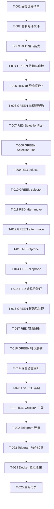

# 开发任务规格文档

## 文档信息

- **功能名称**：youtube-telegram-bot
- **版本**：1.1
- **创建日期**：2026-08-23
- **作者**：Scrum Master Agent
- **状态**：待执行
- **关联文档**：`.boss/youtube-telegram-bot/prd.md`、`.boss/youtube-telegram-bot/architecture.md`

## 摘要

> 首要交付物不是“进程能启动”，而是“真实链接下载到正确、完整且与所选格式一致的媒体，并由 Telegram 实际回传”。旧项目的 `32 passed` 仅是迁移回归基线。

- **任务总数**：25 个原子任务
- **关键路径**：受控迁移 → 运行能力 RED/GREEN → 单视频规范化 RED/GREEN → `SelectionPlan` RED/GREEN → selector RED/GREEN → 机器成品路径 RED/GREEN → ffprobe RED/GREEN → 错误脱敏 RED/GREEN → 真实 YouTube E2E → Telegram 收件验收
- **TDD 规则**：每个缺陷修复都先提交能稳定失败的测试（RED），再提交最小实现（GREEN）；不得先改实现再补同名测试。
- **秘密管理**：执行任何任务都不得读取、打印、复制、哈希或提交旧项目的 `.env`；Token 仅由进程从目标工作区未跟踪的环境配置读取。
- **范围约束**：保留异步 Python 单体、Telegram polling、现有模块边界和管理员能力；不增加 Web UI、数据库、Cookie/登录绕过或多平台下载。

---

## 1. 全局执行规则与完成门禁

1. 只读恢复源固定为 `/Users/wsejoy/Documents/ytdl_bot`；所有代码修改只发生在 `/Users/wsejoy/Documents/ChatGPT/telegram_bot`。
2. 受控复制仅允许 `src/`、`tests/`、`pyproject.toml`、`README.md`、`Dockerfile`、`docker-compose.yml`、`.env.example`、`.gitignore` 和必要的非敏感设计文档；明确排除 `.env`、`.venv/`、`downloads/`、缓存、日志、`*.egg-info`、Local Bot API 数据和媒体产物。
3. 每个 RED 任务必须先记录目标测试失败的测试名和失败原因；GREEN 任务只修复该组失败，并运行该测试文件及完整离线测试。
4. 下载命令必须使用参数数组，不得 `shell=True`；回调数据不得携带任意 URL 或 selector。
5. 禁止跳片：不允许因分享链接中的 `t`、`start`、`end`、`list`、`index` 参数而从中间开始、只取章节/片段或误下播放列表；下载参数不得包含 `--download-sections` 或任何时间裁剪选项。
6. 成功必须同时满足：唯一可信 `after_move` 最终路径、路径在任务目录内、文件非空且非临时件、ffprobe 流/时长/分辨率通过、Telegram 上传成功、任务目录清理成功。
7. 视频/音频完整性容差统一为 `max(2 秒, inspect 源时长 × 1%)`；720p/1080p 不得静默降级，横屏和竖屏均以画面短边判档。
8. 真实样例仅使用团队有权下载的短小公开内容；报告只记录公开 URL/视频 ID 及非敏感元数据，不记录 Token、代理凭据或 Bot API 完整 URL。

---

## 2. 任务详情

### Story S-001：安全迁移并冻结可回退基线

#### Task T-001：生成受控迁移清单与源基线指纹

**类型**：迁移准备 / 只读检查
**依赖**：无
**复杂度**：低

**目标文件**：

| 文件路径 | 操作 | 说明 |
|---|---|---|
| `.boss/youtube-telegram-bot/migration-manifest.txt` | 创建 | 仅列允许迁移的相对路径、大小和 SHA-256 |
| `.boss/youtube-telegram-bot/migration-excludes.txt` | 创建 | 固化排除模式，不含任何 secret 内容或 `.env` 指纹 |

**实现步骤**：

1. 从旧目录枚举受控文件，清单中只使用相对路径；不得打开或哈希 `.env`。
2. 排除 `.env`、`.venv/`、`downloads/`、`.pytest_cache/`、`__pycache__/`、`*.egg-info/`、`*.log`、`telegram-bot-api-data/` 和媒体文件。
3. 对允许文件记录迁移前 SHA-256，作为迁移后及最终交付的只读源对照。

**完成标志**：

- [ ] 清单无 `.env`、Token、代理凭据、绝对媒体路径或生成物
- [ ] 旧项目没有任何写入或时间戳变化

---

#### Task T-002：复制受控源码、测试与工程资产到目标工作区

**类型**：迁移
**依赖**：T-001
**复杂度**：低

**目标文件**：

| 文件路径 | 操作 | 说明 |
|---|---|---|
| `src/ytdl_bot/*.py` | 创建（复制） | 旧应用包基线 |
| `tests/test_*.py` | 创建（复制） | 旧 32 项离线测试基线 |
| `pyproject.toml` | 创建（复制） | 项目与依赖声明 |
| `README.md` | 创建（复制） | 原运行文档基线 |
| `Dockerfile` | 创建（复制） | 容器基线 |
| `docker-compose.yml` | 创建（复制） | Compose 基线 |
| `.env.example` | 创建（复制） | 仅变量名和无敏感示例值 |
| `.gitignore` | 创建/加固 | 忽略 secret、虚拟环境、媒体、缓存和日志 |

**实现步骤**：

1. 按 T-001 清单复制，不使用递归全目录盲拷贝。
2. 新建目标 `.venv` 与空 `downloads/` 只能在后续安装/运行时生成，不能从旧目录复制。
3. 校验目标基线文件与清单哈希一致，并重新校验旧目录允许文件哈希未变。
4. 用 `git status --short --ignored` 确认目标 `.env`、`.venv/`、`downloads/`、缓存和日志不会被跟踪。

**测试用例**：

- `pytest --collect-only -q` 能在目标目录收集不少于 32 项旧测试。
- 目标源码和测试不得通过绝对路径引用旧目录。

**完成标志**：

- [ ] 目标目录可独立收集测试
- [ ] 迁移源保持只读且可回滚
- [ ] 排除项零复制

---

### Story S-002：显式提供 yt-dlp、JavaScript/EJS 与媒体工具能力

#### Task T-003（RED）：先写运行时依赖与能力自检失败测试

**类型**：测试
**依赖**：T-002
**复杂度**：低

**目标文件**：

| 文件路径 | 操作 | 说明 |
|---|---|---|
| `tests/test_runtime_capabilities.py` | 创建 | 依赖声明与自检结果测试 |

**测试用例**：

| 用例 ID | 必须先失败的行为 |
|---|---|
| TC-003-1 | `pyproject.toml` 未声明 `yt-dlp[default]>=2026.08.19` 时失败 |
| TC-003-2 | 缺少 `yt-dlp`、`ffmpeg` 或 `ffprobe` 时返回命名明确的未就绪状态 |
| TC-003-3 | 找不到受支持 JS runtime 时失败，不把“本机碰巧有 Node”视为隐式成功 |
| TC-003-4 | EJS/远程组件能力不可用时失败，且诊断不含环境变量值 |
| TC-003-5 | 下载目录不可写时失败，错误只显示配置项和安全路径摘要 |

**完成标志**：

- [ ] 测试在迁移基线上因缺少能力模块/新依赖声明而按预期失败
- [ ] 失败不是导入拼写或 fixture 配置错误

---

#### Task T-004（GREEN）：升级依赖并实现启动能力自检

**类型**：实现 / 依赖
**依赖**：T-003
**复杂度**：中

**目标文件**：

| 文件路径 | 操作 | 说明 |
|---|---|---|
| `pyproject.toml` | 修改 | 安装声明改为 `yt-dlp[default]>=2026.08.19` |
| `src/ytdl_bot/runtime.py` | 创建 | 检测 yt-dlp 版本、ffmpeg、ffprobe、JS runtime、EJS 和下载目录 |
| `src/ytdl_bot/app.py` | 修改 | 构建/启动 polling 前自检；不就绪则快速失败 |
| `tests/test_runtime_capabilities.py` | 补全 | 验证成功、缺项和脱敏分支 |

**实现步骤**：

1. 在目标新 `.venv` 安装开发依赖并确认实际版本满足 `yt-dlp[default]>=2026.08.19`；不得复用旧 `.venv`。
2. 检测 yt-dlp、ffmpeg/ffprobe、至少一个受支持 JS runtime，以及 EJS/远程组件能力。
3. 自检返回结构化结果；日志只写能力名称、版本和状态，不写环境变量值、代理 URL 或 Token。

**完成标志**：

- [ ] `tests/test_runtime_capabilities.py` 全部通过
- [ ] 缺 JS/EJS 时不会静默继续并产出残缺格式列表

---

### Story S-003：把所有入口规范化为同一个单视频实体

#### Task T-005（RED）：先写普通、Shorts、分享链接与播放列表边界测试

**类型**：测试
**依赖**：T-004
**复杂度**：中

**目标文件**：`tests/test_url_utils.py`、`tests/test_media.py`（修改）

**测试用例**：

| 用例 ID | 必须先失败的行为 |
|---|---|
| TC-005-1 | `watch?v=<id>`、`/shorts/<id>`、`youtu.be/<id>?si=...` 得到同一规范 video ID/URL |
| TC-005-2 | `watch?v=<id>&list=...&index=...&t=45s` 仍只绑定当前 video ID |
| TC-005-3 | 规范下载 URL 不含 `list/index/t/start/end`，避免跳片或误下列表 |
| TC-005-4 | 纯播放列表 `_type=playlist` 或 `entries` 集合在下载前拒绝 |
| TC-005-5 | 非视频 YouTube 路径、伪造子域和非 YouTube URL 不建任务 |
| TC-005-6 | inspect 的 `id/extractor_key/webpage_url` 不一致时拒绝，不能按原始输入二次猜测 |

**完成标志**：

- [ ] 新测试在旧 `url_utils.py/media.py` 上稳定失败

---

#### Task T-006（GREEN）：实现单视频检查和规范 URL 契约

**类型**：实现
**依赖**：T-005
**复杂度**：中

**目标文件**：

| 文件路径 | 操作 | 说明 |
|---|---|---|
| `src/ytdl_bot/url_utils.py` | 修改 | 严格入口路径与主机校验 |
| `src/ytdl_bot/media.py` | 修改 | 验证单 YouTube video 实体，保存 video ID 和规范 URL |
| `src/ytdl_bot/models.py` | 修改 | `MediaInfo` 增加 `video_id`、`canonical_url` |

**实现步骤**：

1. inspect 只接受单个 YouTube 视频结果；拒绝 playlist-only、集合、直播和无法确定 video ID 的结果。
2. 下载 URL 从已验证 video ID 构造规范单视频 URL，不复用含时间戳/列表/追踪参数的原始 URL。
3. 保留 `noplaylist/--no-playlist`，明确不存在任何片段裁剪参数。

**完成标志**：

- [ ] T-005 测试和旧 URL/media 测试全部通过
- [ ] 标准、Shorts、分享入口在 inspect 后使用同一规范单视频 URL

---

### Story S-004：统一按钮枚举和实际下载的选流计划

#### Task T-007（RED）：先写横竖屏分档和 SelectionPlan 契约测试

**类型**：测试
**依赖**：T-006
**复杂度**：中

**目标文件**：`tests/test_media.py`、`tests/test_handlers.py`（修改）

**测试用例**：

| 用例 ID | 必须先失败的行为 |
|---|---|
| TC-007-1 | 1920×1080 与 1080×1920 都归入 1080p（按短边） |
| TC-007-2 | 1280×720 与 720×1280 都归入 720p |
| TC-007-3 | 只有低清 combined 和高清 video-only 时，720/1080 仍生成“视频+音频”计划 |
| TC-007-4 | 只有 720p 时不展示 1080p，禁止用 720p 冒充 1080p |
| TC-007-5 | `MediaChoice` 持有不可伪造 `plan_id`，按钮值不暴露 selector/URL |
| TC-007-6 | 篡改或过期 plan ID 在启动子进程前拒绝 |

**完成标志**：

- [ ] 新测试证明旧 `height` 精确匹配和 `format_id` 未消费问题

---

#### Task T-008（GREEN）：新增 SelectionPlan 并让 UI/下载共用

**类型**：实现
**依赖**：T-007
**复杂度**：高

**目标文件**：

| 文件路径 | 操作 | 说明 |
|---|---|---|
| `src/ytdl_bot/models.py` | 修改 | 新增不可变 `SelectionPlan`；`MediaChoice` 改持 `plan_id` |
| `src/ytdl_bot/media.py` | 修改 | 纯函数 `build_selection_plans`，短边分档，记录成品约束 |
| `src/ytdl_bot/handlers.py` | 修改 | 请求缓存保存 plan 映射；回调只解析 plan ID |
| `tests/test_media.py` | 补全 | plan 稳定性和不可用档位 |
| `tests/test_handlers.py` | 补全 | plan 防篡改和过期 |

**实现步骤**：

1. `SelectionPlan` 至少记录 plan ID、规范 URL、video ID、目标短边、selector、format sort、是否要求音频及输出类型。
2. MP3 和每个视频按钮都由 inspect 结果生成服务端计划；下载层不再按枚举独立重算。
3. 回调完成、失败或 TTL 到期后回收请求；设置缓存 TTL 和容量上限。

**完成标志**：

- [ ] T-007 全部通过
- [ ] 不存在“按钮存 `format_id` 但下载完全不用”的路径

---

### Story S-005：修复 selector 顺序并禁止静默降级/跳片

#### Task T-009（RED）：先写高画质 selector 和安全参数测试

**类型**：测试
**依赖**：T-008
**复杂度**：中

**目标文件**：`tests/test_downloader.py`（修改）

**测试用例**：

| 用例 ID | 必须先失败的行为 |
|---|---|
| TC-009-1 | 720/1080 首选目标 adaptive 视频 + 音频，不以低档 `best[ext=mp4]` 开头 |
| TC-009-2 | 首选 MP4/M4A，缺失时允许通用 video+audio，再回退 combined；`/` 顺序正确 |
| TC-009-3 | 横竖屏使用 `res:<目标短边>` 或等价具体候选，不用 `height<=H` 排除 Shorts |
| TC-009-4 | 参数含 `--no-playlist`，不含 `--download-sections`、时间范围或 shell 字符串 |
| TC-009-5 | CLI 最后只使用 plan 中规范 URL，分享参数不能进入实际下载 |
| TC-009-6 | 无法严格满足所选档位时在下载前失败，不静默降清晰度 |

**完成标志**：

- [ ] 旧测试 `prefer_progressive_mp4_for_smaller_downloads` 被正确的高画质断言替换
- [ ] 新测试在旧 selector 上因首分支抢占而失败

---

#### Task T-010（GREEN）：按 SelectionPlan 构造正确 selector

**类型**：实现
**依赖**：T-009
**复杂度**：高

**目标文件**：`src/ytdl_bot/downloader.py`、`src/ytdl_bot/models.py`、`tests/test_downloader.py`（修改）

**实现步骤**：

1. 基线采用 `bv*+ba/b` 语义：目标高画质视频+音频优先，MP4/M4A 是偏好而非唯一组合。
2. 720/1080 只有真正存在目标短边计划时才执行；不得以低档 progressive MP4 作为成功回退。
3. MP3 保留音频提取，但同样使用规范 URL、机器成品路径和后续完整性校验。

**完成标志**：

- [ ] T-009 和旧 downloader 测试全部通过
- [ ] 用户文本只作为参数值进入固定参数数组

---

### Story S-006：用机器可读协议取得唯一最终成品

#### Task T-011（RED）：先写 after_move、路径越界和临时件测试

**类型**：测试
**依赖**：T-010
**复杂度**：中

**目标文件**：`tests/test_downloader.py`（修改）

**测试用例**：

| 用例 ID | 必须先失败的行为 |
|---|---|
| TC-011-1 | 参数同时含显式 `--progress` 和 `--print after_move:RESULT:%(filepath)j` |
| TC-011-2 | 正确解析含空格/Unicode 的 JSON 转义 `RESULT:` 路径 |
| TC-011-3 | 无 RESULT、多个 RESULT、非法 JSON 都失败，不扫描“最新文件”冒充成功 |
| TC-011-4 | 绝对路径逃逸、`..`、符号链接逃逸或任务目录外路径失败 |
| TC-011-5 | `.part`、`.ytdl`、sidecar、分片目录和零字节文件失败 |
| TC-011-6 | 混合进度行和 RESULT 行时只把进度交给状态回调 |

**完成标志**：

- [ ] 新测试明确复现 `_newest_file` 可能误选中间件的问题

---

#### Task T-012（GREEN）：实现 after_move 最终路径协议并移除时间猜测

**类型**：实现
**依赖**：T-011
**复杂度**：中

**目标文件**：`src/ytdl_bot/downloader.py`、`tests/test_downloader.py`（修改）

**实现步骤**：

1. 使用 JSON 转义的 `after_move` 输出机器标记；不要从面向人的进度文本或 mtime 推断路径。
2. 解析 realpath 后验证其位于 `downloads/<task_id>/`，且是唯一、存在、非空、非临时的普通文件。
3. 删除 `_newest_file` 主路径；如保留兜底，仅可诊断且不得判成功。

**完成标志**：

- [ ] T-011 全部通过
- [ ] 合并成品路径是 `DownloadResult.path` 的唯一来源

---

### Story S-007：用 ffprobe 阻断截断、缺流和错误清晰度

#### Task T-013（RED）：先写媒体成品校验失败测试

**类型**：测试
**依赖**：T-012
**复杂度**：高

**目标文件**：

| 文件路径 | 操作 | 说明 |
|---|---|---|
| `tests/test_transcode.py` | 修改 | ffprobe JSON、容差、流和分辨率测试 |
| `tests/fixtures/media/README.md` | 创建 | 生成无版权小型本地 fixture 的说明，不放真实下载产物 |

**测试用例**：

| 用例 ID | 必须先失败的行为 |
|---|---|
| TC-013-1 | 视频无视频流或源有音频但成品无音频流时失败 |
| TC-013-2 | MP3 无音频流、无法解析或零时长时失败 |
| TC-013-3 | 成品时长差超过 `max(2 秒, 1%)` 时判定截断 |
| TC-013-4 | 720/1080 成品短边不等于 plan 目标时失败，竖屏按 `min(width,height)` |
| TC-013-5 | ffprobe 非零、非法 JSON、缺字段、不可读首尾时失败 |
| TC-013-6 | 合法横屏、竖屏、完整 MP3 通过 |

**完成标志**：

- [ ] 测试在旧“只看退出码和文件大小”的实现上失败

---

#### Task T-014（GREEN）：实现 ffprobe 校验并接入下载成功判定

**类型**：实现
**依赖**：T-013
**复杂度**：高

**目标文件**：

| 文件路径 | 操作 | 说明 |
|---|---|---|
| `src/ytdl_bot/transcode.py` | 修改 | ffprobe JSON 探测、`validate_media`、兼容性判定 |
| `src/ytdl_bot/models.py` | 修改 | 探测结果/校验结果数据结构 |
| `src/ytdl_bot/downloader.py` | 修改 | RESULT 取得后、返回前强制校验 |
| `tests/test_transcode.py` | 补全 | 通过和所有失败类别 |

**实现步骤**：

1. ffprobe 至少读取 format duration、stream codec_type、width/height、codec_name 和容器信息。
2. 视频计划要求视频流；源含音频时要求音频流；MP3 要求音频流；时长使用统一容差。
3. 清晰度按短边严格核验；目标不可用应在下载前拒绝，校验失败不得发送。
4. 非 Telegram 兼容视频可转 H.264/AAC MP4，但转码后必须再次 ffprobe；不得仅改扩展名。

**完成标志**：

- [ ] T-013 全部通过
- [ ] 缺流、截断、错清晰度和不可解析文件不能产生 `DownloadResult`

---

#### Task T-015（RED）：先写压缩/转码后二次校验测试

**类型**：测试
**依赖**：T-014
**复杂度**：中

**目标文件**：`tests/test_transcode.py`、`tests/test_delivery.py`（修改）

**测试用例**：

- 超限视频压缩结果必须在阈值内、含视频/音频、时长合格且为 Telegram 兼容 MP4。
- 三次压缩仍超限或二次 ffprobe 失败时不调用 Telegram send 方法。
- 原视频通过且未超限时不做无意义转码。

**完成标志**：

- [ ] 新测试在旧压缩函数只检查大小的实现上失败

---

#### Task T-016（GREEN）：对转码/压缩产物执行同一完整性门禁

**类型**：实现
**依赖**：T-015
**复杂度**：中

**目标文件**：`src/ytdl_bot/transcode.py`、`src/ytdl_bot/delivery.py`、`tests/test_transcode.py`、`tests/test_delivery.py`（修改）

**完成标志**：

- [ ] T-015 全部通过
- [ ] 上传对象始终是最近一次验证通过的成品路径
- [ ] 压缩失败/二次校验失败不发生任何 Telegram 文件发送

---

### Story S-008：错误分层、脱敏、资源释放和 Bot 响应性

#### Task T-017（RED）：先写阶段化错误与脱敏测试

**类型**：测试
**依赖**：T-016
**复杂度**：中

**目标文件**：`tests/test_handlers.py`、`tests/test_downloader.py`、`tests/test_app.py`（修改）

**测试用例**：

| 用例 ID | 必须先失败的行为 |
|---|---|
| TC-017-1 | 用户消息区分解析、格式不可用、下载、合并、转码、校验、上传阶段 |
| TC-017-2 | stderr 含 Token、代理凭据、Bot API URL、绝对路径时，聊天和常规日志均不出现原值 |
| TC-017-3 | 日志含短任务 ID、规范 video ID、选择/实际档位、阶段和错误分类 |
| TC-017-4 | 成功、子进程失败、校验失败、上传失败、取消都释放配额并清理任务目录 |
| TC-017-5 | 回调完成/失败后移除请求缓存，过期请求返回 `REQUEST_EXPIRED` |
| TC-017-6 | 慢下载期间 `/help` 仍可响应；Update 并发有上限且连接池足够 |

**完成标志**：

- [ ] 新测试复现旧 handlers 将 `RuntimeError`/stderr 直接回给用户的问题

---

#### Task T-018（GREEN）：实现领域错误、脱敏日志与 finally 清理

**类型**：实现
**依赖**：T-017
**复杂度**：高

**目标文件**：

| 文件路径 | 操作 | 说明 |
|---|---|---|
| `src/ytdl_bot/errors.py` | 创建 | 错误码、阶段、安全用户文案和统一 redactor |
| `src/ytdl_bot/downloader.py` | 修改 | 原始 stderr 仅进入脱敏诊断，抛领域错误 |
| `src/ytdl_bot/transcode.py` | 修改 | 合并/转码/校验分类 |
| `src/ytdl_bot/delivery.py` | 修改 | 上传错误分类 |
| `src/ytdl_bot/handlers.py` | 修改 | 任务 ID、用户文案、缓存/目录 finally 清理 |
| `src/ytdl_bot/app.py` | 修改 | 有界 `concurrent_updates` 和匹配连接池 |
| `tests/test_handlers.py`、`tests/test_app.py` | 补全 | 资源释放、脱敏和并发回归 |

**错误码最低集合**：`INVALID_URL`、`INSPECT_FAILED`、`MEDIA_REJECTED`、`FORMAT_UNAVAILABLE`、`LIMIT_REACHED`、`DOWNLOAD_FAILED`、`MERGE_FAILED`、`TRANSCODE_FAILED`、`VALIDATION_FAILED`、`UPLOAD_FAILED`、`REQUEST_EXPIRED`。

**完成标志**：

- [ ] T-017 全部通过
- [ ] 任一失败不杀死 Bot，下一任务仍可执行

---

#### Task T-019：回归管理员命令、清理边界和大文件策略

**类型**：测试 + 最小修复
**依赖**：T-018
**复杂度**：中

**目标文件**：`tests/test_cleanup.py`、`tests/test_limits.py`、`tests/test_handlers.py`、`tests/test_delivery.py`、`src/ytdl_bot/cleanup.py`、`src/ytdl_bot/limits.py`（按测试最小修改）

**完成标志**：

- [ ] `/status`、`/cleanup`、`/broadcast` 权限和脱敏正确
- [ ] 清理不跟随符号链接或危险路径越界，取消/异常释放配额
- [ ] 超限视频压缩、非视频分片且顺序名正确

---

### Story S-009：把真实 YouTube 下载设为自动化发布门禁

#### Task T-020：建立可重复的真实 E2E 清单和执行器

**类型**：测试基础设施
**依赖**：T-019
**复杂度**：高

**目标文件**：

| 文件路径 | 操作 | 说明 |
|---|---|---|
| `tests/live/samples.example.json` | 创建 | 非敏感样例 schema 与占位 |
| `tests/live/test_youtube_e2e.py` | 创建 | 真实 inspect/download/ffprobe/清理测试 |
| `tests/live/test_telegram_e2e.py` | 创建 | 真实上传和 Telegram 文件回读测试 |
| `scripts/run_live_e2e.py` | 创建 | 显式 opt-in 的矩阵执行器和 JSON 报告 |
| `.gitignore` | 修改 | 忽略真实收件、原始运行产物和本机样例覆盖文件 |

**实现步骤**：

1. 样例 schema 定义 `case_id/url/expected_video_id/expected_title/source_duration/target/expected_short_edge`；真实运行值放未跟踪本机文件。
2. 用 pytest `live` marker 隔离网络测试；默认离线 `pytest` 不连接 YouTube/Telegram。
3. 每个成功用例记录 inspect 与最终探测的非敏感对比；失败仅保留阶段、错误码、任务 ID 和脱敏摘要。
4. 测试结束无论成功失败都清理任务目录。

**完成标志**：

- [ ] 执行器逐项运行并输出机器可读报告
- [ ] 无 Token、代理凭据或 Bot API 完整 URL 落盘

---

#### Task T-021：执行普通、Shorts、分享链接、MP3、720p/1080p 真实下载验收

**类型**：真实 E2E / P0 门禁
**依赖**：T-020
**复杂度**：高

**目标文件**：`.boss/youtube-telegram-bot/e2e-youtube-report.md`（创建）

**必测矩阵**：

| 用例 ID | 输入/选择 | 验收 |
|---|---|---|
| E2E-YT-01 | 普通 `watch?v=`，选 720p | video ID/标题正确，双流，短边 720，完整时长 |
| E2E-YT-02 | adaptive 视频，选 1080p | 不被 360p progressive 抢占，双流，短边 1080 |
| E2E-YT-03 | `/shorts/<id>`，选实际可用最高档 | 竖屏按短边分档，方向/双流/时长完整 |
| E2E-YT-04 | `youtu.be/<id>?si=...`，选 MP3 | 同一 video ID，音频流、标题、时长合格 |
| E2E-YT-05 | `watch?v=<id>&list=...&index=...&t=...` | 只下当前视频，从头开始，唯一最终媒体 |
| E2E-YT-06 | 纯播放列表 URL | 下载前拒绝，不生成媒体 |

**执行要求**：

1. 每个视频实际解码首段和末段，不能仅靠 duration metadata；MP3 也抽查首尾可解码。
2. 720/1080 样例须在 inspect 阶段确认对应 adaptive 流存在；若源没有目标档位则更换合法样例，不允许低档代替。
3. 报告记录 yt-dlp/ffmpeg/ffprobe/JS runtime/EJS 版本或能力状态，不记录 secret。

**完成标志**：

- [ ] 六个用例全部通过；任一失败阻断发布
- [ ] 无跳片、缺流、错视频、截断或静默降级

---

### Story S-010：Telegram 真实连接、回传和收件文件验收

#### Task T-022：验证 Bot 身份、polling 和并发互斥

**类型**：Telegram 连接验收
**依赖**：T-021
**复杂度**：中

**目标文件**：`.boss/youtube-telegram-bot/e2e-telegram-report.md`（创建）

**实现步骤**：

1. Token 仅从目标工作区未跟踪环境读取；先确保同一 Token 没有第二个 polling 实例争抢 Update。
2. 安全检查 Bot 身份并启动 `python -m ytdl_bot`，确认进入 polling；报告不记 Token/完整 API URL。
3. 慢下载期间发送 `/help`，确认有界 Update 并发仍可响应。
4. 主动触发无效链接或不可用格式，确认阶段化提示后 Bot 仍能处理下一消息。

**完成标志**：

- [ ] `/start`、`/help` 和格式按钮可实际交互
- [ ] polling 稳定且无 409 多实例冲突
- [ ] 连接日志无 secret

---

#### Task T-023：通过 Telegram 完成真实回传并探测“收件文件”

**类型**：真实 E2E / 最终 P0 门禁
**依赖**：T-022
**复杂度**：高

**目标文件**：`tests/live/test_telegram_e2e.py`、`.boss/youtube-telegram-bot/e2e-telegram-report.md`（补全）

**必测步骤**：

1. 将普通视频、Shorts、分享链接、MP3、720p、1080p 经实际 Bot 对话回传到授权测试聊天。
2. 以 Telegram 返回消息/file ID 为依据，把 Telegram 侧实际文件下载到隔离临时目录；不能用发送前本地文件替代。
3. 对收件文件重新 ffprobe，比对 video ID/标题关联、时长、音视频流、短边分辨率并解码首尾。
4. 验证音频优先 `sendAudio`、视频优先 `sendVideo`，必要时 `sendDocument`；上传失败有可操作建议。
5. 每次发送后关闭句柄，确认 Bot 任务目录清理；回读目录也在报告生成后清理。

**完成标志**：

- [ ] 普通/Shorts/分享/MP3/720/1080 的 Telegram 收件文件全部正确完整
- [ ] 错标题、错清晰度、缺流、截断、跳片、错聊天或残留目录均阻断发布

---

### Story S-011：Docker、文档、安全扫描和最终交付

#### Task T-024：让本机与 Docker 都显式具备 JS/EJS 和媒体能力

**类型**：DevOps
**依赖**：T-023
**复杂度**：中

**目标文件**：

| 文件路径 | 操作 | 说明 |
|---|---|---|
| `Dockerfile` | 修改 | 安装 ffmpeg/ffprobe、受支持 JS runtime 和 default extra 依赖 |
| `docker-compose.yml` | 修改 | 保留受控 downloads 挂载和可选 Local API；不烘焙 `.env` |
| `.dockerignore` | 创建 | 排除 `.env`、`.venv`、downloads、测试产物、缓存、`.git` |
| `tests/test_runtime_capabilities.py` | 补全 | 容器能力和无 secret 断言 |
| `.boss/youtube-telegram-bot/deploy-report.md` | 修改 | 本机/容器版本、自检和 E2E 状态 |

**实现步骤**：

1. 容器自检确认 `yt-dlp[default]>=2026.08.19`、ffmpeg、ffprobe、受支持 JS runtime 和 EJS 可用。
2. 容器至少执行普通 720/1080、分享 MP3、Shorts 和 adaptive 合并真实 E2E；失败不得用本机通过替代。
3. 静态检查 Compose，不把 Token 放入 image layer、build arg 或版本控制文件。

**完成标志**：

- [ ] 本机和容器能力一致
- [ ] Docker E2E 不出现格式缺失、JS/EJS 警告被吞或成品错误

---

#### Task T-025：更新文档并执行最终发布门禁

**类型**：文档 / QA / 交付
**依赖**：T-024
**复杂度**：中

**目标文件**：

| 文件路径 | 操作 | 说明 |
|---|---|---|
| `README.md` | 修改 | 本机安装、JS/EJS 自检、polling、真实验收、故障分类和合法边界 |
| `.env.example` | 修改 | 仅变量名和非敏感默认值 |
| `.boss/youtube-telegram-bot/qa-report.md` | 修改 | 离线、真实 YouTube、Telegram 收件和清理证据 |
| `.boss/youtube-telegram-bot/migration-manifest.txt` | 更新验证区 | 记录旧源关键文件仍未改变 |

**最终检查**：

1. `pytest -q`：不少于旧 32 项且新增缺陷回归全部通过。
2. `python -m compileall src tests scripts`：全部通过。
3. live E2E：普通、Shorts、分享、MP3、720、1080、播放列表拒绝和失败诊断全部通过。
4. Telegram 收件矩阵：对回读文件重新 ffprobe 并通过。
5. 容器构建、自检、Compose 静态检查及规定容器 E2E 全部通过。
6. 版本控制 secret 扫描；确认 `.env`、`.venv/`、`downloads/`、缓存、日志、媒体和 live 本机配置未跟踪。
7. 复核 T-001 指纹，确认旧项目未被迁移或测试修改。

**完成标志**：

- [ ] README 命令在当前 Mac 上逐条验证且不依赖旧目录
- [ ] 报告明确区分“离线通过”和“真实回传通过”
- [ ] secret 扫描零命中，旧项目保持不变
- [ ] 只有 T-023、T-024 均通过后才可标记“可交付”

---

## 3. 任务依赖图

---

## 4. 文件变更汇总

### 4.1 迁移/保留

| 文件 | 任务 | 说明 |
|---|---|---|
| `src/ytdl_bot/*.py`、`tests/test_*.py` | T-002 | 从只读旧项目受控复制 |
| `pyproject.toml`、`README.md`、`Dockerfile`、`docker-compose.yml` | T-002 | 工程资产基线 |
| `.env`、`.venv/`、`downloads/`、缓存、日志 | 永不迁移 | secret 或机器生成物 |

### 4.2 新建文件

| 文件 | 任务 | 说明 |
|---|---|---|
| `src/ytdl_bot/runtime.py` | T-004 | 环境能力自检 |
| `src/ytdl_bot/errors.py` | T-018 | 阶段化错误和安全文案 |
| `tests/test_runtime_capabilities.py` | T-003 | JS/EJS/ffmpeg/yt-dlp 自检测试 |
| `tests/live/samples.example.json` | T-020 | live 样例 schema |
| `tests/live/test_youtube_e2e.py` | T-020 | 真实下载门禁 |
| `tests/live/test_telegram_e2e.py` | T-020/T-023 | Telegram 收件门禁 |
| `scripts/run_live_e2e.py` | T-020 | E2E 执行器 |
| `.dockerignore` | T-024 | 容器上下文脱敏 |

### 4.3 重点修改文件

| 文件 | 任务 | 核心变更 |
|---|---|---|
| `src/ytdl_bot/models.py` | T-006/T-008/T-014 | video ID、规范 URL、SelectionPlan、探测结果 |
| `src/ytdl_bot/media.py` | T-006/T-008 | 单视频检查、短边分档、共用计划 |
| `src/ytdl_bot/downloader.py` | T-010/T-012/T-014/T-018 | selector、after_move、ffprobe 接入、脱敏 |
| `src/ytdl_bot/transcode.py` | T-014/T-016/T-018 | 流/时长/分辨率和转码后二次验证 |
| `src/ytdl_bot/handlers.py` | T-008/T-018 | plan 防篡改、缓存回收、阶段状态和清理 |
| `src/ytdl_bot/app.py` | T-004/T-018 | 启动自检和有界 Update 并发 |
| `pyproject.toml` | T-004 | `yt-dlp[default]>=2026.08.19` |

---

## 5. Definition of Done

- [ ] 当前工作区可独立安装、测试、启动，不引用旧源码。
- [ ] 旧 32 项基线和新增 RED→GREEN 回归全部通过，compileall 通过。
- [ ] 安装声明和实际环境均满足 `yt-dlp[default]>=2026.08.19`。
- [ ] 本机和 Docker 都检测并启用受支持 JavaScript runtime/EJS、ffmpeg、ffprobe。
- [ ] 普通、Shorts、分享链接绑定正确 video ID，禁止播放列表误下和时间参数跳片。
- [ ] 720/1080 selector 优先正确 adaptive 视频+音频，实际短边严格匹配且不静默降级。
- [ ] 最终路径来自唯一 `after_move:RESULT` 机器标记，而非“最新文件”。
- [ ] ffprobe 阻断缺流、截断、零字节、错误分辨率和不可解析产物。
- [ ] 用户错误阶段化且可操作，日志可按任务 ID 排障但不泄露 secret。
- [ ] 真实 YouTube 六类矩阵通过；Telegram 实际收件文件重新探测通过。
- [ ] 成功、失败、取消和上传异常后均释放资源并清理任务目录。
- [ ] `.env`、Token、代理凭据、虚拟环境、缓存、下载产物和日志未进入版本控制或报告。

---

## 变更记录

| 版本 | 日期 | 作者 | 变更内容 |
|---|---|---|---|
| 1.1 | 2026-08-23 | Scrum Master Agent | 基于 PRD、架构及旧源码/tests，将安全迁移、selector 修复、yt-dlp default extra、JS/EJS、after_move、ffprobe、脱敏和真实 Telegram E2E 拆为 RED→GREEN 原子任务 |
